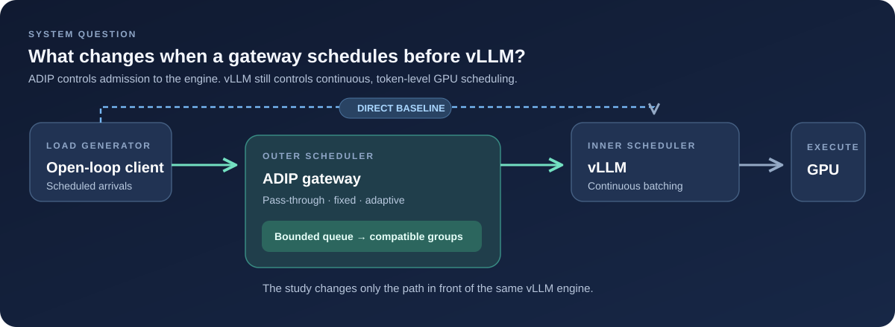
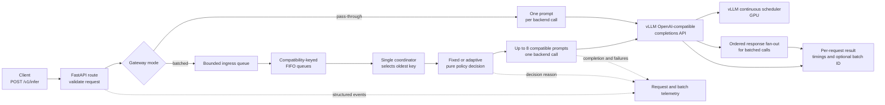
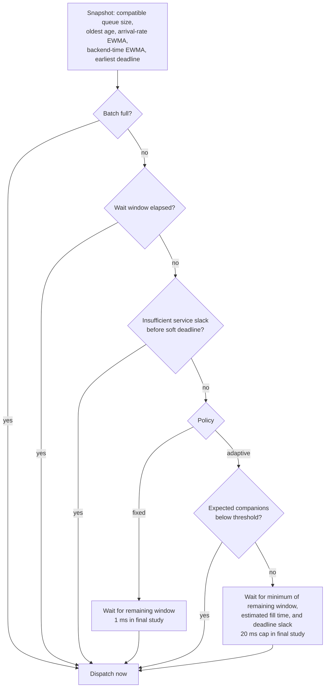
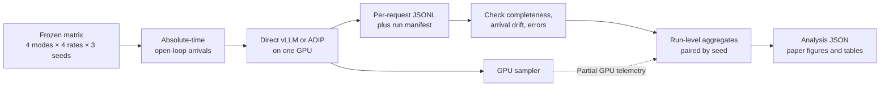

# VeloInference

[](https://github.com/wasiqnauman/veloinference/actions/workflows/ci.yml)

**What happens when an API gateway batches requests before an LLM engine that already batches them?**

VeloInference is a working inference gateway and open-loop experiment harness for studying that two-scheduler interaction. Its Async Dynamic Inference Proxy (ADIP) implements pass-through, fixed-window, and adaptive request paths in front of vLLM. The measured result is an architecture warning: a larger outer batch can mean *more waiting*, not more useful work.



| 48 conditions | 6,912 requests | +1.05–1.51 s paired p95 latency |
| :---: | :---: | :---: |
| 4 paths × 4 rates × 3 runs | All completed; no harness-invalid runs | Fixed 1 ms batching vs pass-through at 1.0–1.8 requests/s |

The final study used `Qwen/Qwen2.5-1.5B-Instruct` on a single RTX 3060. At 0.5 requests/s, the fixed-policy latency effect was unresolved. The tested adaptive policy showed no statistically resolved p95 advantage over fixed batching at any rate. [Read the paper PDF](paper/main.pdf) · [Browse the source](paper/main.tex) · [Inspect the analysis](results/summaries/generated/exp003-analysis.json) · [Reproduce the experiment](docs/REPRODUCIBILITY.md)

## The result in one picture


*Each point is a mean of three run-wise paired differences; whiskers are two-sided 95% Student-t intervals. Positive values mean the fixed policy was slower. The comparison isolates the outer scheduler by using gateway pass-through as the baseline. [Chart generator](scripts/render_readme_chart.py).*


The fixed policy's outer group grew from 1.54 prompts per backend call at 1.0 requests/s to 2.90 at 1.8 requests/s. Its nominal wait was only **1 ms**, yet mean gateway queue delay reached **767–833 ms**. The coordinator awaits one backend call before dispatching the next batch; requests arriving during that call can accumulate. Across fixed and adaptive runs, measured group sizes closely matched a serial-occupancy prediction (0.86% mean absolute percentage error; descriptive R² = 0.9985). This is a within-run consistency check, not an independent causal estimate. [See the full mechanism figure](paper/figures/mechanism_effects.png).

## System design

ADIP's architecture makes scheduling decisions observable without changing vLLM's token-level scheduler. Direct mode bypasses ADIP. Pass-through mode adds HTTP translation and telemetry but sends one prompt per backend call. Fixed and adaptive modes use the queueing path below.



**Compatibility contract.** Requests share a backend call only when `model`, `max_tokens`, and `temperature` match. The vLLM adapter sends their prompts as one list and restores output order. The oldest compatible queue is selected first; each queue is FIFO. A full ingress queue returns HTTP 503 before accepting more work.

**Scheduling contract.** One asynchronous coordinator drains ingress, asks a policy when to close the selected batch, and awaits the backend call. The policy only decides; the coordinator owns waiting, queue mutation, and dispatch. This serial await is deliberate and measurable, but it can withhold admission opportunities from vLLM.



The adaptive policy estimates compatible arrival rate and backend time with EWMAs (α = 0.2 in the final study). It bypasses an intentional wait when the expected number of companions is below 1.0. This cannot undo a backlog that formed while the coordinator was awaiting vLLM.

**Completion and failure contract.** Every accepted request receives an ID; every dispatched batch receives a batch ID. Responses include queue, backend, and total gateway time plus an optional deadline outcome. A backend failure settles every affected request future. Cancellation and shutdown settle queued and in-flight futures. Events capture lifecycle and policy reasons without prompt text or credentials. See [`gateway/core/batcher.py`](gateway/core/batcher.py), [`gateway/core/service.py`](gateway/core/service.py), and [`gateway/backends/vllm.py`](gateway/backends/vllm.py).

## How the finding was measured



Scheduled arrivals continue independently of service slowdown, so offered load does not silently fall when latency rises. The analyzer requires the complete 48-condition matrix and rejects harness-invalid runs. The public repository contains the frozen configuration, tests, analysis code, figures, and [machine-readable summary](results/summaries/generated/exp003-analysis.json); raw request and GPU traces remain in the private research archive. The recorded completion metric is normalized by the fixed arrival schedule and **is not a saturation-capacity measurement**. GPU monitor gaps prevent a matrix-level utilization, VRAM, power, or thermal comparison.

| Evidence | Open |
| --- | --- |
| Full result plots and uncertainty | [Primary overview](paper/figures/primary_overview.png) · [Mechanism and paired effects](paper/figures/mechanism_effects.png) |
| Research method and limits | [Paper PDF](paper/main.pdf) · [Paper source](paper/main.tex) · [Evaluation](paper/sections/05_evaluation.tex) |
| Frozen setup and replication | [Final experiment config](configs/experiments/primary_final.toml) · [Reproduction guide](docs/REPRODUCIBILITY.md) |

## Run it locally

The CPU-safe development path uses Python 3.12 and the mock backend:

```bash
uv sync --all-groups
uv run python -m gateway.main
```

In another terminal:

```bash
curl http://127.0.0.1:8000/health
```

Run the quality gates with `uv run ruff check .` and `uv run pytest -q`. Docker also supports the mock service with `docker compose up --build`. For the real vLLM setup and frozen experiment, follow the [reproduction guide](docs/REPRODUCIBILITY.md); it requires Linux or WSL2 and a CUDA-capable NVIDIA GPU.

## Repository map

| Path | Purpose |
| --- | --- |
| [`gateway/`](gateway/) | FastAPI route, queueing coordinator, policies, backend adapters, and observability |
| [`bench/`](bench/) | Open-loop arrivals, run recording, validity checks, and analysis |
| [`configs/`](configs/) | Mock setup and frozen final-experiment configuration |
| [`results/summaries/generated/`](results/summaries/generated/) | Audited machine-readable final summary |
| [`paper/`](paper/) | Manuscript, generated tables, and full-size scientific figures |
| [`tests/`](tests/) | Gateway and experiment-harness tests |

The result characterizes one model, one GPU, short prompts, four offered rates, and three repetitions per condition. It is evidence about this two-scheduler configuration, not a universal claim about gateway batching.
