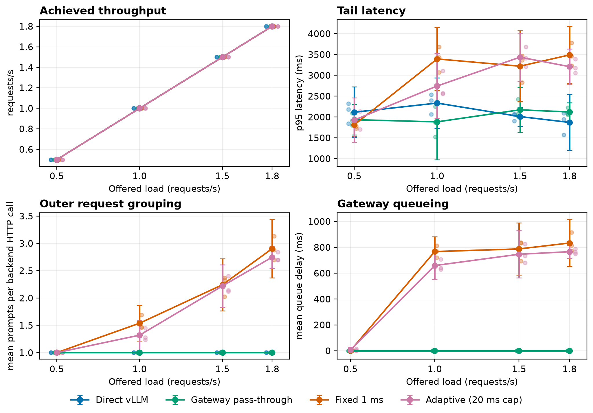

# VeloInference (ADIP)

[](https://github.com/wasiqnauman/veloinference/actions/workflows/ci.yml)

VeloInference is a research artifact for studying a deceptively simple systems
question: what happens when an API gateway batches requests before sending them
to an LLM engine that already performs continuous batching?

The included Async Dynamic Inference Proxy (ADIP), open-loop benchmark harness,
and analysis pipeline support four controlled paths:

- direct requests to vLLM;
- gateway pass-through without outer batching;
- fixed-window gateway batching; and
- adaptive gateway batching.

The project is intentionally narrow. It characterizes the interaction between
two schedulers on a single consumer GPU; it does not claim to replace a
production inference engine.

## Main finding

Across a 48-condition, 6,912-request experiment using
`Qwen/Qwen2.5-1.5B-Instruct` on an RTX 3060, a 1 ms fixed gateway window formed
larger outer batches but increased paired p95 latency by 1.05-1.51 seconds at
1.0-1.8 requests/second relative to pass-through. The low-load effect was
unresolved, and the adaptive policy did not produce a statistically resolved
improvement over the fixed policy at any tested rate.

The observed outer group sizes closely matched a serial-occupancy model
(0.86% mean absolute percentage error; descriptive R² = 0.9985). In this
regime, larger gateway batches primarily reflected requests accumulating while
the gateway awaited vLLM, rather than useful millisecond-scale coalescing.



See the [paper source](paper/main.tex),
[machine-readable analysis](results/summaries/generated/exp003-analysis.json),
and [reproduction guide](docs/REPRODUCIBILITY.md) for the full evidence and
limitations.

## System design

```text
Open-loop benchmark client
    |
    +--> direct ------------------------------> vLLM
    |
    +--> pass-through / fixed / adaptive ----> ADIP ----> vLLM
```

ADIP provides bounded asynchronous queueing, fixed and adaptive batch-closing
policies, vLLM and mock backends, request-level event logging, and metrics for
queue delay, backend time, batch size, and failures. The benchmark runner uses
scheduled open-loop arrivals so service slowdown does not silently reduce
offered load.

## Repository map

| Path | Purpose |
| --- | --- |
| `gateway/` | FastAPI gateway, batching policies, backends, and observability |
| `bench/` | Open-loop load generation, GPU monitoring, validation, and analysis |
| `configs/` | Public mock and frozen final-experiment configurations |
| `results/summaries/generated/` | Audited machine-readable final summary |
| `paper/` | LaTeX manuscript, generated tables, and publication figures |
| `tests/` | Unit and integration tests for the gateway and research harness |

## Quick start

The CPU-safe development path uses Python 3.12 and the mock backend:

```bash
uv sync --all-groups
uv run python -m gateway.main
```

In another terminal:

```bash
curl http://127.0.0.1:8000/health
```

Run the quality gates with:

```bash
uv run ruff check .
uv run pytest -q
```

Docker is also supported for the mock service:

```bash
docker compose up --build
```

## Research scope

The final matrix used one GPU, one 1.5B-parameter model, short prompts, four
offered rates, and three repetitions per condition. Confidence intervals are
computed over run-level values. The committed summary contains the complete
48-condition analysis; raw request and GPU traces are not included in this
public repository. Conclusions should therefore be read as a controlled
single-system result, not a universal statement about gateway batching.
